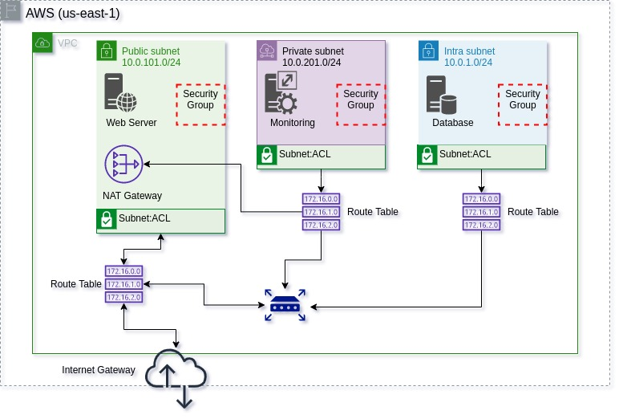

# EC2 complete example



## Requirements

| Name | Version |
|------|---------|
| docker | >= 20.10.7 |
| GNU Make | >= 4.2.1 |

## How to configure

- AWS credentials

Create an `.env` file at your module directory containing the AWS access credentials.

```
AWS_ACCESS_KEY_ID=<my_access_key_id>
AWS_SECRET_ACCESS_KEY=<my_access_key_secret>
```

- SSH keypair

You need to create a SSH keypair and inform the public key in the `my_key_file` variable.
Store your private key safely and use it to access the EC2 instances.

The default pattern is to create a `ssh` directory at your module path.

## How to execute

Use `make` commands to run Terraform in this example. The command `make help` shows available options.

Basically, you can run this example using:

- For syntax and validation tests:
```shell
> make unit-tests
```

- For apply the terraform code:
```shell
> make apply
```